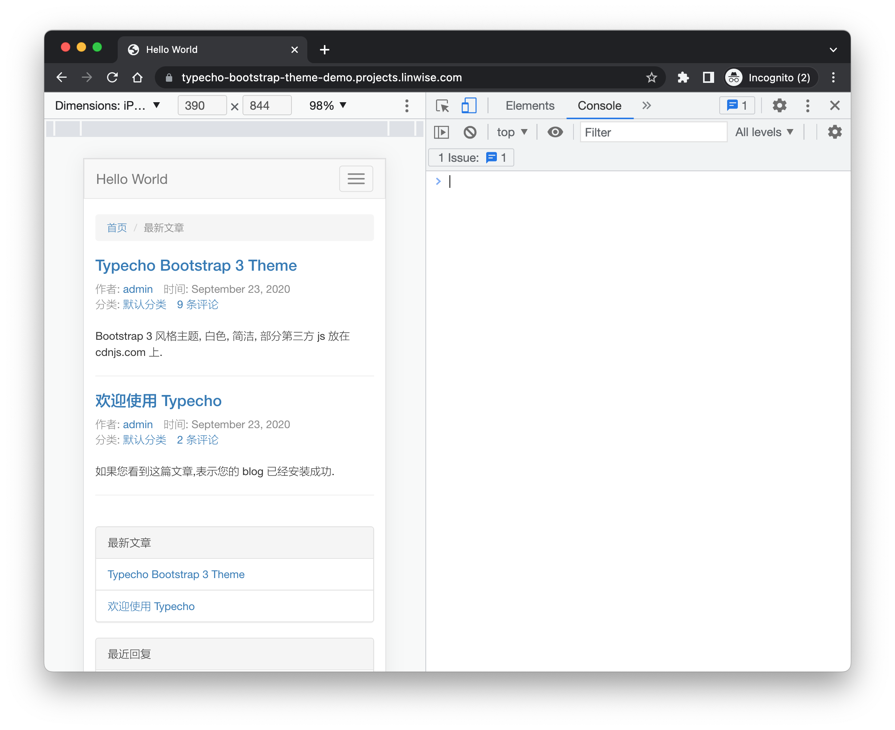
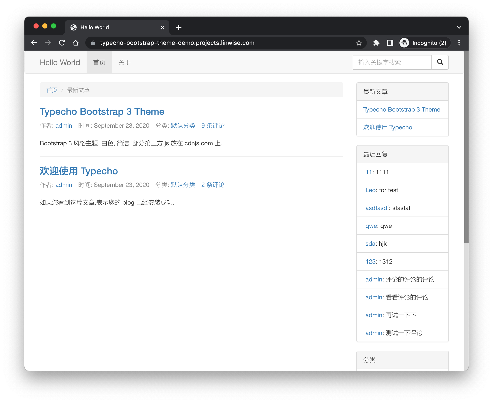

# Typecho Bootstrap Theme

Yet another simple responsive bootstrap theme for [Typecho](http://typecho.org/). Bootstrap 3 actually. 😅

Here is the [demo](http://typecho-bootstrap-theme-demo.projects.linwise.com) and [demo repo](https://github.com/shrekuu/typecho-bootstrap-theme-demo).

## Screenshots

Mobile

Desktop

## Misc

- This theme uses staticfile.org to serve normalize & bootstrap CSS files.
